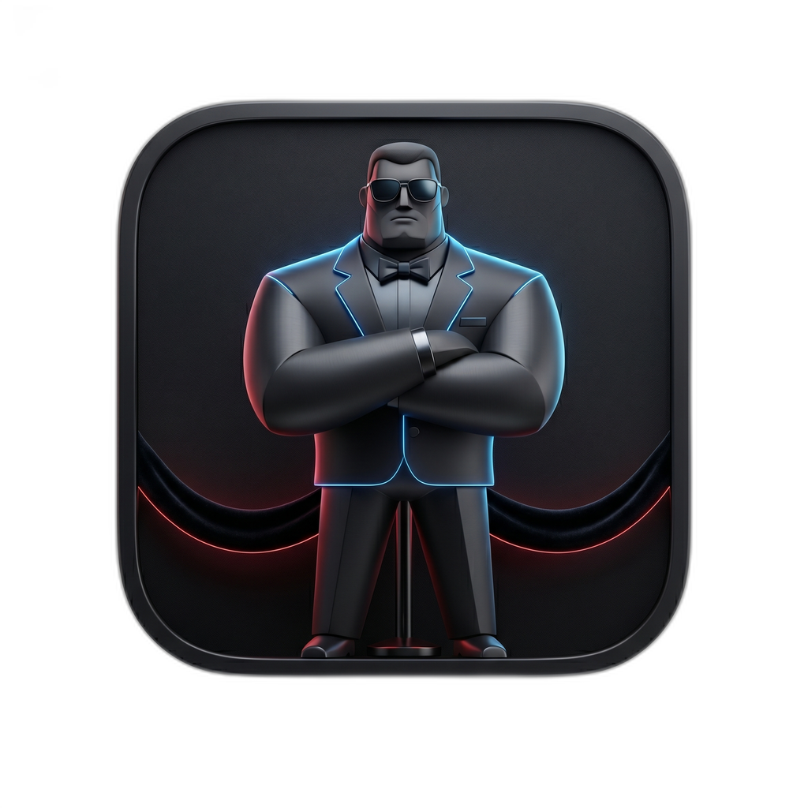
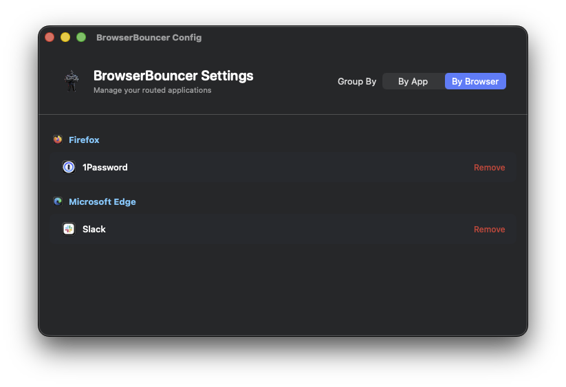
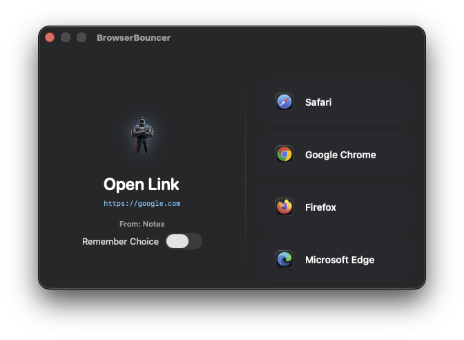

  
  <h1>BrowserBouncer</h1>
  
<em>The intelligent web link router for macOS.</em>

  

    
    
    
  

  

 

BrowserBouncer is a lightweight, open-source macOS menu bar application that acts as a smart router for your web links. It intercepts standard URL opening events, checks which desktop application sent the request, and instantly routes the link to the correct browser based on your custom rules.

---

## ✨ Features

- 🎯 **Seamless Routing**: Route links from specific apps (e.g., Slack) to specific browsers (e.g., Microsoft Edge) automatically.
- 💬 **Dynamic Interception Prompt**: If an app isn't allow-listed, BrowserBouncer prompts you to choose a browser and optionally remember the choice.
- 🕵️ **Advanced Source Detection**: Accurately identifies source applications, even those hidden behind Electron frameworks or sandboxes (like Discord or VSCode), by using frontmost application fallback logic.

---

## 📸 Screenshots

  
  &nbsp;
  

---

## 🚧 Roadmap

- [ ] **HTML File Handling**: Support opening local `.html` files directly in your chosen browser via BrowserBouncer, rather than requiring a manual "Open With" workaround.
- [ ] **Browser Profile Support**: Allow rules to target specific profiles within a browser (e.g., open work links in your Edge Work profile and personal links in your Edge Personal profile).
- [ ] **Light Mode Support**: Native light theme implementation for the routing interface and setup views.
- [ ] **Cloud Sync**: Optional iCloud syncing for your custom routing rules across multiple Macs.

---

## 📥 Installation

### Mac App Store (Recommended)

The easiest way to get BrowserBouncer is directly from the Mac App Store — no setup required.

### Build from Source

Prefer to build it yourself? Clone the repo and build with Xcode:

1. Clone the repository.
2. Open `BrowserBouncer.xcodeproj` in Xcode.
3. Build and run the `BrowserBouncer` scheme.

*Note: Ensure you have `swiftlint` installed (`brew install swiftlint`) as it is used to enforce code styling.*

---

## 💬 Feedback & Issues

Found a bug or have a feature request? We'd love to hear about it. Please [open an issue](https://github.com/bdog720/BrowserBouncer/issues) here on GitHub.

## 🤝 Contributing

We welcome contributions! Please see [CONTRIBUTING.md](CONTRIBUTING.md) for details on how to open issues or submit pull requests.

## 📄 License

This project is licensed under the Apache License 2.0. See the [LICENSE](LICENSE) file for details.

## 💖 Support the Project

If you find BrowserBouncer useful and it saves you from copying and pasting links all day, consider buying me a coffee to support future development!

